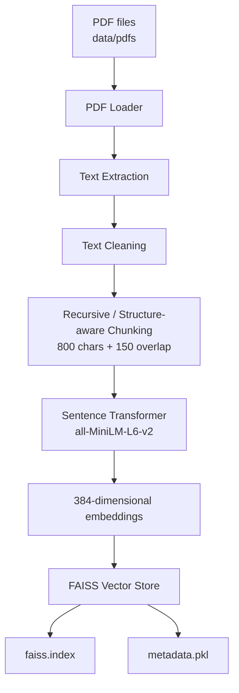
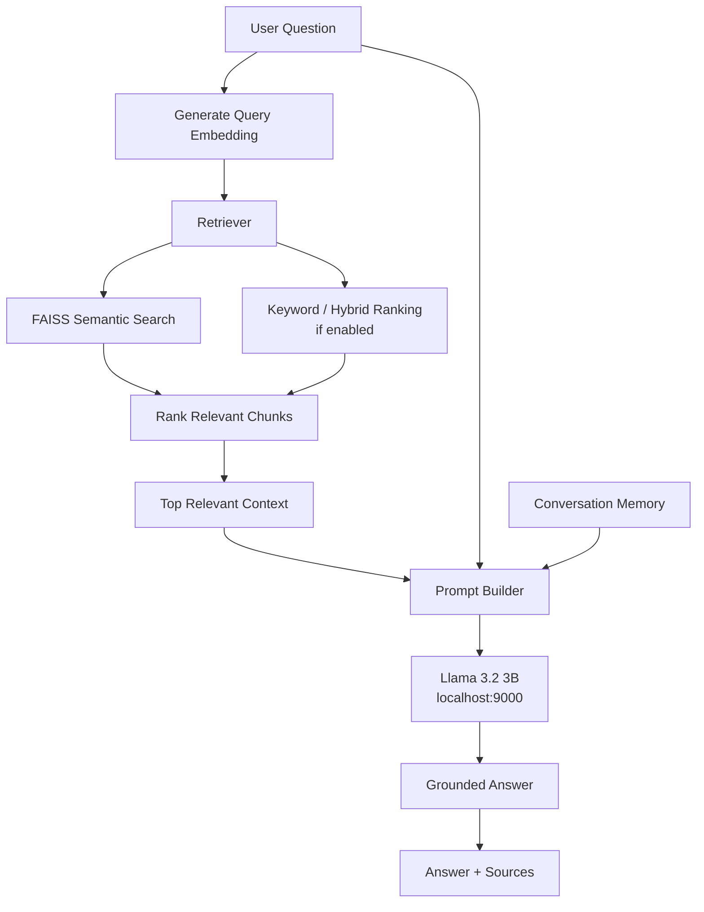
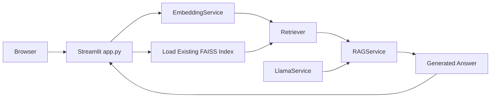
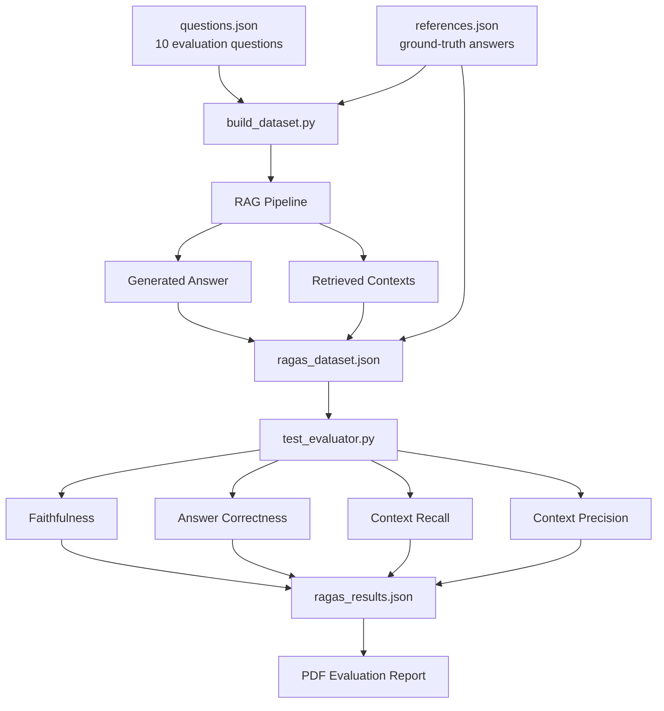

# RAG Assignment

A local Retrieval-Augmented Generation (RAG) application built with Python, Sentence Transformers, FAISS, llama.cpp, Streamlit, and an evaluation pipeline.

The repository currently uses:

- **Embedding model:** `sentence-transformers/all-MiniLM-L6-v2`
- **Embedding dimension:** `384`
- **Vector store:** FAISS
- **LLM endpoint:** `http://localhost:9000`
- **LLM model alias:** `llama3.2:3b`
- **Chunk size:** `800`
- **Chunk overlap:** `150`
- **UI:** Streamlit

---

## 1. Application Flow

### 1.1 Indexing Pipeline



The indexing pipeline is executed by:

```powershell
python index_documents.py
```

---

### 1.2 Query / RAG Pipeline



---

### 1.3 Streamlit Application Flow



---

### 1.4 Evaluation Flow



### Required evaluation thresholds

| Metric               | Minimum |
|----------------------|---------|
| Faithfulness         | > 90%   |
| Answer Correctness   | > 80%   |
| Context Recall       | > 85%   |
| Context Precision    | > 80%   |

## 2. Project Structure

```text
rag-assignment/
│
├── app.py
├── config.py
├── index_documents.py
├── main.py
├── requirements.txt
├── README.md
│
├── data/
│   ├── pdfs/
│   │   ├── 1706.03762v7.pdf
│   │   ├── 1810.04805v2.pdf
│   │   ├── 1907.11692v1.pdf
│   │   ├── 1910.10683v4.pdf
│   │   └── 2005.14165v4.pdf
│   │
│   ├── processed/
│   │   ├── faiss.index
│   │   └── metadata.pkl
│   │
│   ├── ragas_dataset.json
│   └── ragas_results.json
│
├── src/
│   ├── ingestion/
│   │   └── pdf_loader.py
│   │
│   ├── chunking/
│   │   ├── document_chunker.py
│   │   ├── text_chunker.py
│   │   └── text_cleaner.py
│   │
│   ├── embeddings/
│   │   └── embedding_service.py
│   │
│   ├── vector_store/
│   │   └── faiss_store.py
│   │
│   ├── retrieval/
│   │   └── retriever.py
│   │
│   ├── generation/
│   │   ├── llama_service.py
│   │   └── prompt_builder.py
│   │
│   ├── conversation/
│   │   └── memory.py
│   │
│   ├── rag/
│   │   └── rag_service.py
│   │
│   └── evaluation/
│       ├── questions.json
│       ├── references.json
│       ├── build_dataset.py
│       ├── ragas_llm.py
│       ├── ragas_embeddings.py
│       └── test_evaluator.py


> File locations may differ slightly depending on the current branch. Update paths in this README if evaluation JSON files are kept under `data/evaluation/`.

---

## 3. Prerequisites

Install the following before running the project:

- Python **3.13**
- Git
- Docker Desktop
- VS Code (recommended)
- A local GGUF Llama model, for example:
  `Llama-3.2-3B-Instruct-Q4_K_M.gguf`

Check installations:

```powershell
python --version
git --version
docker --version
```

---

## 4. Clone the Repository

```powershell
git clone https://github.com/sumitkumarph/rag-assignment.git
cd rag-assignment
```

---

## 5. Create the Main Python Environment

Create:

```powershell
py -3.13 -m venv .venv
```

Activate in PowerShell:

```powershell
.\.venv\Scripts\Activate.ps1
```

Upgrade pip:

```powershell
python -m pip install --upgrade pip
```

Install project dependencies:

```powershell
python -m pip install -r requirements.txt
```

If required individually:

```powershell
python -m pip install pypdf
python -m pip install sentence-transformers
python -m pip install faiss-cpu
python -m pip install requests
python -m pip install streamlit
```

Verify:

```powershell
python -c "import faiss; print('FAISS OK')"
python -c "from sentence_transformers import SentenceTransformer; print('Sentence Transformers OK')"
```

---

## 6. Configuration

The central configuration is in:

```text
config.py
```

Example:

```python
CHUNK_SIZE = 800
CHUNK_OVERLAP = 150

EMBEDDING_MODEL = "sentence-transformers/all-MiniLM-L6-v2"

LLAMA_BASE_URL = "http://localhost:9000"
LLAMA_MODEL = "llama3.2:3b"
LLAMA_MAX_TOKEN = 256
```

FAISS files are stored under:

```text
data/processed/faiss.index
data/processed/metadata.pkl
```

---

## 7. Start the Local Llama Server

The Python application expects an OpenAI-compatible endpoint at:

```text
http://localhost:9000/v1/chat/completions
```

### llama.cpp Docker example

Place the GGUF model in a local folder, for example:

```text
C:\models\Llama-3.2-3B-Instruct-Q4_K_M.gguf
```

Then run:

```powershell
docker run --rm `
  --name llama-server `
  -p 9000:8080 `
  -v C:/models:/models `
  ghcr.io/ggml-org/llama.cpp:server `
  -m /models/Llama-3.2-3B-Instruct-Q4_K_M.gguf `
  --host 0.0.0.0 `
  --port 8080 `
  --alias llama3.2:3b `
  -c 4096 `
  -n 256
```

If GPU acceleration is available, use the appropriate llama.cpp CUDA image and GPU flags.

### Verify the server

```powershell
curl.exe http://localhost:9000/health
```

```powershell
curl.exe http://localhost:9000/v1/models
```

Test generation:

```powershell
curl.exe -s http://localhost:9000/v1/chat/completions `
  -H "Content-Type: application/json" `
  -d '{"model":"llama3.2:3b","messages":[{"role":"user","content":"Say hello"}],"temperature":0,"max_tokens":20}'
```

Do not continue to indexing/query evaluation if the tiny Llama request hangs or times out.

---

## 8. Add PDF Documents

Put the input PDFs in:

```text
data/pdfs/
```

The application currently works with the five NLP research papers stored in this directory.

---

## 9. Build / Rebuild the FAISS Index

Whenever you change any of the following, rebuild FAISS:

- PDF files
- chunking strategy
- chunk size
- chunk overlap
- embedding model

Run:

```powershell
python index_documents.py
```

Expected output includes:

```text
Total chunks: ...
Number of embeddings: ...
Embedding dimensions: 384
FAISS vectors: ...
FAISS index saved
Metadata saved
```

The current chunking configuration is intended to preserve meaningful paragraph/sentence boundaries instead of blindly cutting text.

---

## 10. Run the Command-Line RAG Application

If `main.py` is configured as the CLI query entry point:

```powershell
python main.py
```

The query pipeline loads:

1. Sentence Transformer
2. existing FAISS index
3. Retriever
4. Prompt Builder
5. Llama service
6. RAG service

---

## 11. Run the Streamlit UI

Make sure:

1. FAISS index has already been created.
2. Llama server is running on port 9000.

Then:

```powershell
streamlit run app.py
```

or:

```powershell
python -m streamlit run app.py
```

Open:

```text
http://localhost:8501
```

The UI loads the embedding model and existing FAISS index, creates the Retriever and Llama service, and maintains conversation history.

---

## 12. Evaluation Setup

The evaluation uses a separate environment so RAG dependencies and evaluation dependencies can be isolated.

Create it:

```powershell
py -3.13 -m venv .venv-ragas
```

Activate:

```powershell
.\.venv-ragas\Scripts\Activate.ps1
```

Install:

```powershell
python -m pip install --upgrade pip
python -m pip install ragas==0.3.9
python -m pip install "langchain-community==0.3.31"
python -m pip install langchain-openai
python -m pip install datasets
python -m pip install sentence-transformers
python -m pip install faiss-cpu
python -m pip install reportlab
```

Verify:

```powershell
python -c "import ragas; print('RAGAS OK:', ragas.__version__)"
```

```powershell
python -c "from ragas.metrics import faithfulness, answer_correctness, context_recall, context_precision; print('METRICS OK')"
```

---

## 13. Evaluation Input Files

The evaluation uses:

```text
src/evaluation/questions.json
src/evaluation/references.json
```

`questions.json` contains the 10 test questions.

Example:

```json
{
  "id": "Q01",
  "document": "1706.03762v7.pdf",
  "topic": "Transformer",
  "type": "concept",
  "question": "What problem does the Transformer architecture address?"
}
```

`references.json` contains the matching ground-truth answer.

Example:

```json
{
  "id": "Q01",
  "reference_answer": "..."
}
```

---

## 14. Build the Evaluation Dataset

Activate `.venv-ragas` if required:

```powershell
.\.venv-ragas\Scripts\Activate.ps1
```

Delete an old evaluation dataset when the retrieval/indexing strategy has changed:

```powershell
Remove-Item .\data\ragas_dataset.json -ErrorAction SilentlyContinue
```

Build a fresh dataset:

```powershell
python -m src.evaluation.build_dataset
```

Each successful record should contain:

```json
{
  "id": "Q01",
  "question": "...",
  "answer": "...",
  "contexts": [
    "...",
    "..."
  ],
  "reference": "..."
}
```

Do not run final evaluation with empty answers or empty contexts.

---

## 15. Run Evaluation

```powershell
python -m src.evaluation.test_evaluator
```

Expected summary:

```text
FINAL EVALUATION RESULTS

faithfulness        XX.XX% (Required > 90%) PASS/FAIL
answer_correctness  XX.XX% (Required > 80%) PASS/FAIL
context_recall      XX.XX% (Required > 85%) PASS/FAIL
context_precision   XX.XX% (Required > 80%) PASS/FAIL

OVERALL RESULT: PASS/FAIL
```

Results are saved to:

```text
data/ragas_results.json
```

---

## 16. Generate the PDF Evaluation Report

If `src/evaluation/generate_report.py` is present:

```powershell
python -m src.evaluation.generate_report
```

The final report should contain:

- evaluation date
- total questions
- per-question scores
- Faithfulness
- Answer Correctness
- Context Recall
- Context Precision
- required thresholds
- PASS / FAIL per metric
- overall PASS / FAIL

---

## 17. Complete Run Order

For a fresh machine:

```text
1. Clone repository
2. Create .venv
3. Install requirements
4. Start llama.cpp server
5. Verify /health and /v1/models
6. Put PDFs in data/pdfs
7. Run index_documents.py
8. Run main.py OR streamlit run app.py
9. Create/activate .venv-ragas
10. Install evaluation dependencies
11. Run build_dataset.py
12. Verify all 10 evaluation records are complete
13. Run test_evaluator.py
14. Generate PDF evaluation report
```

Commands:

```powershell
git clone https://github.com/sumitkumarph/rag-assignment.git
cd rag-assignment

py -3.13 -m venv .venv
.\.venv\Scripts\Activate.ps1

python -m pip install --upgrade pip
python -m pip install -r requirements.txt

python index_documents.py

python -m streamlit run app.py
```

Evaluation:

```powershell
deactivate

py -3.13 -m venv .venv-ragas
.\.venv-ragas\Scripts\Activate.ps1

python -m pip install --upgrade pip
python -m pip install ragas==0.3.9
python -m pip install "langchain-community==0.3.31"
python -m pip install langchain-openai datasets sentence-transformers faiss-cpu reportlab

python -m src.evaluation.build_dataset
python -m src.evaluation.test_evaluator
python -m src.evaluation.generate_report
```

---

## 18. When to Rebuild What?

| Change | Rebuild FAISS? | Rebuild `ragas_dataset.json`? |
|---|---:|---:|
| Prompt only | No | Yes |
| Llama generation settings | No | Yes |
| Retriever ranking / `top_k` | No | Yes |
| Chunk size | Yes | Yes |
| Chunk overlap | Yes | Yes |
| Chunking algorithm | Yes | Yes |
| Embedding model | Yes | Yes |
| PDF documents | Yes | Yes |
| Evaluation questions only | No | Yes |
| Evaluation scoring logic only | No | No |

---

## 19. Troubleshooting

### `ModuleNotFoundError: No module named 'src'`

Run modules from the repository root:

```powershell
python -m src.evaluation.build_dataset
```

instead of:

```powershell
python src/evaluation/build_dataset.py
```

### `ModuleNotFoundError: No module named 'faiss'`

```powershell
python -m pip install faiss-cpu
```

### `ModuleNotFoundError: No module named 'sentence_transformers'`

```powershell
python -m pip install sentence-transformers
```

### Llama timeout

First test the server directly:

```powershell
curl.exe http://localhost:9000/health
curl.exe http://localhost:9000/v1/models
```

Then try a tiny chat-completions request. If the tiny request also hangs, fix the llama.cpp server before changing RAG code.

### FAISS index missing

```powershell
python index_documents.py
```

### Streamlit blank/error page

Start from the project root:

```powershell
python -m streamlit run app.py
```

Check the terminal for import errors or a missing FAISS index.

### RAGAS VertexAI import error

For the compatible evaluation environment used by this project:

```powershell
python -m pip install ragas==0.3.9
python -m pip install "langchain-community==0.3.31"
```

---

## 20. RAG Quality Improvement Strategy

Improve retrieval first:

```text
Chunking
   ↓
Embedding
   ↓
FAISS / Hybrid Retrieval
   ↓
Candidate Retrieval
   ↓
Reranking
   ↓
Best Context
```

This primarily improves:

- Context Recall
- Context Precision

Then improve generation:

```text
Best Context
   ↓
Strict Grounding Prompt
   ↓
Llama
   ↓
Structured / concise answer
```

This primarily improves:

- Faithfulness
- Answer Correctness

Recommended grounding rule:

```text
Answer the question ONLY using the provided context.
If the answer is not present in the context, say that you do not have
enough information. Do not assume, extrapolate, or use outside knowledge.
```

---

## 21. Technologies

- Python
- PyPDF
- Sentence Transformers
- `all-MiniLM-L6-v2`
- FAISS
- llama.cpp
- Llama 3.2 3B
- Streamlit
- LangChain OpenAI-compatible client
- RAG evaluation
- ReportLab

---

## 22. Repository

Public repository:

```text
https://github.com/sumitkumarph/rag-assignment
```
